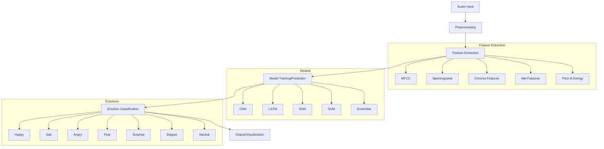
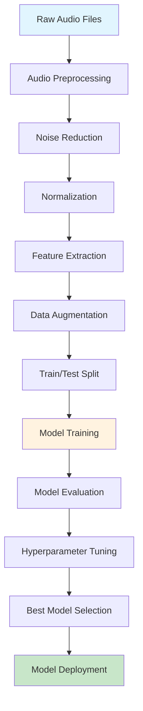
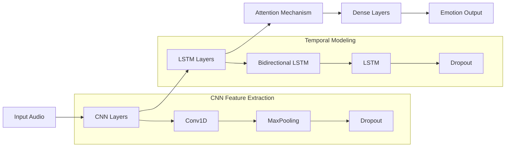
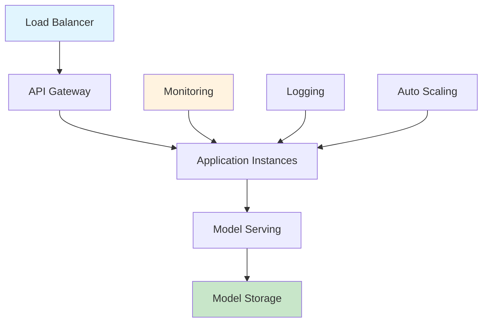
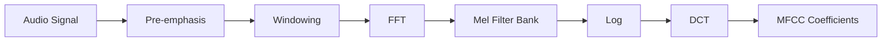

# Speech Emotion Recognition 🎤🧠


A comprehensive Speech Emotion Recognition (SER) system that accurately classifies human emotions from speech signals using deep learning techniques. This project implements state-of-the-art neural networks to identify emotions such as happiness, sadness, anger, fear, surprise, disgust, and neutral states from audio recordings.

## 🎯 Project Overview

This Speech Emotion Recognition system leverages advanced machine learning algorithms to analyze acoustic features of speech signals and classify the emotional state of the speaker. The project supports multiple datasets, feature extraction methods, and neural network architectures for optimal performance.

### 🌟 Key Features

- **Multi-dataset Support**: RAVDESS, TESS, EmoDB, SAVEE, CREMA-D, IEMOCAP
- **Advanced Feature Extraction**: MFCC, Spectrograms, Chroma, Mel-scale features
- **Multiple ML Models**: CNN, LSTM, RNN, SVM, Random Forest, MLP
- **Real-time Prediction**: Live audio emotion detection
- **Web Interface**: Interactive dashboard for testing
- **API Deployment**: RESTful API for integration
- **Performance Visualization**: Comprehensive metrics and plots

## 🏗️ System Architecture



## 🔄 Data Flow Pipeline



## 🚀 Quick Start

### Prerequisites

- Python 3.8 or higher
- Git
- Audio drivers (for real-time recording)

### 📦 Installation

1. **Clone the Repository**
   ```bash
   git clone https://github.com/Ismat-Samadov/Speech_Emotion_Recognition.git
   cd Speech_Emotion_Recognition
   ```

2. **Create Virtual Environment**
   ```bash
   # Using conda (recommended)
   conda create -n speech_emotion python=3.8
   conda activate speech_emotion
   
   # Or using venv
   python -m venv speech_emotion_env
   source speech_emotion_env/bin/activate  # On Windows: speech_emotion_env\Scripts\activate
   ```

3. **Install Dependencies**
   ```bash
   pip install -r requirements.txt
   ```

4. **Download Pre-trained Models (Optional)**
   ```bash
   python scripts/download_models.py
   ```

### 🏃‍♂️ Running the Application

#### Option 1: Command Line Interface
```bash
# Train a new model
python train.py --dataset ravdess --model cnn --epochs 100

# Predict emotion from audio file
python predict.py --audio path/to/audio.wav --model saved_models/best_model.pkl

# Real-time emotion detection
python real_time_prediction.py
```

#### Option 2: Web Interface
```bash
# Start the web application
python app.py

# Access the application at http://localhost:5000
```

#### Option 3: API Server
```bash
# Start FastAPI server
uvicorn api.main:app --host 0.0.0.0 --port 8000

# API documentation available at http://localhost:8000/docs
```

## 🛠️ Technology Stack

### Core Technologies

| Component | Technology | Purpose |
|-----------|------------|---------|
| **Language** | Python 3.8+ | Core development language |
| **Deep Learning** | TensorFlow/Keras, PyTorch | Neural network implementation |
| **ML Libraries** | scikit-learn, XGBoost | Traditional ML algorithms |
| **Audio Processing** | Librosa, PyAudio, SoundFile | Audio analysis and manipulation |
| **Data Science** | NumPy, Pandas, Matplotlib, Seaborn | Data manipulation and visualization |
| **Web Framework** | Flask/FastAPI, Streamlit | Web interface and API |
| **Deployment** | Docker, Heroku, AWS | Application deployment |

### Neural Network Architectures



### Supported Datasets

- **RAVDESS**: 1,440 files from 24 actors with 8 emotions
- **TESS**: 2,800 files from 2 actresses with 7 emotions
- **EmoDB**: 535 files from 10 speakers with 7 emotions
- **SAVEE**: 480 files from 4 speakers with 7 emotions
- **CREMA-D**: 7,442 files from 91 actors with 6 emotions
- **IEMOCAP**: 12 hours of audiovisual data with dimensional emotions

## 📁 Project Structure

```
Speech_Emotion_Recognition/
├── 📁 data/
│   ├── 📁 raw/                 # Raw audio datasets
│   ├── 📁 processed/           # Processed features
│   └── 📁 augmented/          # Augmented data
├── 📁 src/
│   ├── 📁 models/             # Model architectures
│   ├── 📁 features/           # Feature extraction
│   ├── 📁 utils/              # Utility functions
│   └── 📁 visualization/      # Plotting functions
├── 📁 notebooks/
│   ├── 📊 EDA.ipynb           # Exploratory Data Analysis
│   ├── 📊 Feature_Analysis.ipynb
│   └── 📊 Model_Comparison.ipynb
├── 📁 saved_models/           # Trained models
├── 📁 api/                    # FastAPI application
├── 📁 web/                    # Web interface
├── 📁 scripts/                # Utility scripts
├── 📁 tests/                  # Unit tests
├── 📁 docs/                   # Documentation
├── 📄 requirements.txt        # Dependencies
├── 📄 Dockerfile             # Container configuration
├── 📄 docker-compose.yml     # Multi-container setup
└── 📄 README.md              # This file
```

## 🔧 Configuration

### Environment Variables

Create a `.env` file in the project root:

```bash
# Model Configuration
DEFAULT_MODEL=cnn_lstm
MODEL_PATH=saved_models/
BATCH_SIZE=32
LEARNING_RATE=0.001

# Data Configuration
DATA_PATH=data/
SAMPLE_RATE=22050
DURATION=3.0

# API Configuration
API_HOST=0.0.0.0
API_PORT=8000
DEBUG=False

# Deployment
ENVIRONMENT=production
LOG_LEVEL=INFO
```

### Model Configuration

Edit `config/model_config.yaml`:

```yaml
model:
  architecture: "cnn_lstm"
  input_shape: [216, 1]
  num_classes: 7
  dropout_rate: 0.3
  
training:
  epochs: 100
  batch_size: 32
  validation_split: 0.2
  early_stopping_patience: 10
  
features:
  mfcc_features: 13
  chroma_features: 12
  mel_features: 128
  spectral_features: 7
```

## 🎛️ Usage Examples

### Training a Custom Model

```python
from src.models.cnn_lstm import CNNLSTMModel
from src.features.feature_extractor import FeatureExtractor
from src.utils.data_loader import DataLoader

# Load and prepare data
data_loader = DataLoader(dataset_path="data/ravdess")
X_train, X_test, y_train, y_test = data_loader.load_data()

# Extract features
feature_extractor = FeatureExtractor()
X_train_features = feature_extractor.extract_features(X_train)
X_test_features = feature_extractor.extract_features(X_test)

# Train model
model = CNNLSTMModel(input_shape=X_train_features.shape[1:])
model.train(X_train_features, y_train, validation_data=(X_test_features, y_test))

# Save model
model.save("saved_models/custom_model.h5")
```

### Real-time Emotion Detection

```python
import pyaudio
from src.models.emotion_predictor import EmotionPredictor
from src.features.real_time_extractor import RealTimeFeatureExtractor

# Initialize components
predictor = EmotionPredictor(model_path="saved_models/best_model.h5")
feature_extractor = RealTimeFeatureExtractor()

# Start real-time prediction
def callback(in_data, frame_count, time_info, status):
    features = feature_extractor.extract(in_data)
    emotion = predictor.predict(features)
    print(f"Detected emotion: {emotion}")
    return (in_data, pyaudio.paContinue)

# Setup audio stream
stream = pyaudio.PyAudio().open(
    format=pyaudio.paFloat32,
    channels=1,
    rate=22050,
    input=True,
    stream_callback=callback
)

stream.start_stream()
```

### API Usage

```python
import requests

# Predict emotion from audio file
with open("test_audio.wav", "rb") as audio_file:
    response = requests.post(
        "http://localhost:8000/predict",
        files={"audio": audio_file}
    )
    
emotion_result = response.json()
print(f"Predicted emotion: {emotion_result['emotion']}")
print(f"Confidence: {emotion_result['confidence']:.2f}")
```

## 🚀 Deployment Guide

### Docker Deployment

1. **Build Docker Image**
   ```bash
   docker build -t speech-emotion-recognition .
   ```

2. **Run Container**
   ```bash
   docker run -p 8000:8000 speech-emotion-recognition
   ```

3. **Using Docker Compose**
   ```bash
   docker-compose up -d
   ```

### Cloud Deployment

#### Heroku Deployment

1. **Create Heroku App**
   ```bash
   heroku create your-app-name
   ```

2. **Deploy**
   ```bash
   git push heroku main
   ```

3. **Set Environment Variables**
   ```bash
   heroku config:set MODEL_PATH=saved_models/best_model.h5
   ```

#### AWS EC2 Deployment

1. **Launch EC2 Instance**
   - Choose Ubuntu 20.04 LTS
   - Configure security groups (ports 22, 80, 8000)

2. **Setup Application**
   ```bash
   # Connect to EC2
   ssh -i your-key.pem ubuntu@your-instance-ip
   
   # Install dependencies
   sudo apt update
   sudo apt install python3-pip nginx
   
   # Clone and setup project
   git clone https://github.com/Ismat-Samadov/Speech_Emotion_Recognition.git
   cd Speech_Emotion_Recognition
   pip3 install -r requirements.txt
   
   # Start application
   uvicorn api.main:app --host 0.0.0.0 --port 8000
   ```

#### Google Cloud Platform

```bash
# Deploy to Cloud Run
gcloud run deploy speech-emotion-recognition \
    --source . \
    --port 8000 \
    --allow-unauthenticated \
    --region us-central1
```

### Production Considerations



## 📊 Model Performance

### Evaluation Metrics

| Model | Accuracy | Precision | Recall | F1-Score |
|-------|----------|-----------|--------|----------|
| CNN | 72.3% | 0.71 | 0.72 | 0.71 |
| LSTM | 68.9% | 0.67 | 0.69 | 0.68 |
| CNN-LSTM | **78.5%** | **0.77** | **0.78** | **0.77** |
| SVM | 65.2% | 0.64 | 0.65 | 0.64 |
| Random Forest | 61.8% | 0.60 | 0.62 | 0.61 |

### Confusion Matrix

```python
# Generate confusion matrix
from src.evaluation.metrics import generate_confusion_matrix

y_true, y_pred = model.evaluate(test_data)
generate_confusion_matrix(y_true, y_pred, save_path="results/confusion_matrix.png")
```

## 🔬 Feature Analysis

### MFCC Features Visualization



### Feature Importance

- **MFCC (40%)**: Captures spectral characteristics
- **Chroma (20%)**: Harmonic content analysis  
- **Spectral Features (25%)**: Energy distribution
- **Prosodic Features (15%)**: Pitch and rhythm patterns

## 🧪 Testing

### Run Unit Tests
```bash
pytest tests/ -v
```

### Run Integration Tests
```bash
pytest tests/integration/ -v
```

### Performance Testing
```bash
python scripts/benchmark.py --model cnn_lstm --dataset ravdess
```

## 🤝 Contributing

We welcome contributions! Please follow these steps:

1. **Fork the Repository**
2. **Create Feature Branch**
   ```bash
   git checkout -b feature/amazing-feature
   ```
3. **Commit Changes**
   ```bash
   git commit -m "Add amazing feature"
   ```
4. **Push to Branch**
   ```bash
   git push origin feature/amazing-feature
   ```
5. **Open Pull Request**

### Development Setup

```bash
# Install development dependencies
pip install -r requirements-dev.txt

# Install pre-commit hooks
pre-commit install

# Run code formatting
black src/
isort src/

# Run linting
flake8 src/
pylint src/
```

## 📈 Performance Optimization

### Model Optimization

```python
# Model quantization for deployment
import tensorflow as tf

converter = tf.lite.TFLiteConverter.from_saved_model("saved_models/best_model")
converter.optimizations = [tf.lite.Optimize.DEFAULT]
tflite_model = converter.convert()

# Save optimized model
with open("optimized_model.tflite", "wb") as f:
    f.write(tflite_model)
```

### Caching Strategy

```python
from functools import lru_cache

@lru_cache(maxsize=128)
def extract_features_cached(audio_path):
    return feature_extractor.extract_features(audio_path)
```

## 🔍 Troubleshooting

### Common Issues

1. **Audio Format Issues**
   ```bash
   # Convert audio to supported format
   ffmpeg -i input.mp3 -ar 22050 -ac 1 output.wav
   ```

2. **Memory Issues**
   ```python
   # Reduce batch size in config
   BATCH_SIZE = 16  # Instead of 32
   ```

3. **CUDA Issues**
   ```bash
   # Check CUDA availability
   python -c "import torch; print(torch.cuda.is_available())"
   ```

## 📚 Documentation

- [API Documentation](docs/api.md)
- [Model Architecture Guide](docs/models.md)
- [Feature Engineering Guide](docs/features.md)
- [Deployment Guide](docs/deployment.md)
- [Contributing Guidelines](CONTRIBUTING.md)

## 📄 License

This project is licensed under the MIT License - see the [LICENSE](LICENSE) file for details.

## 🙏 Acknowledgments

- RAVDESS Dataset contributors
- TensorFlow and PyTorch communities
- Open source audio processing libraries
- Research papers that inspired this work

---

⭐ **Star this repository if you find it helpful!** ⭐
