# Car Marketplace Business Intelligence Report

## Executive Summary

This analysis examines **2,249 active vehicle listings** across the marketplace, providing strategic insights into market dynamics, pricing strategies, customer behavior, and competitive positioning. The findings reveal significant opportunities for growth, operational optimization, and strategic decision-making.

**Key Highlights:**
- Market value exceeds **68.6 million** in total listing value
- High customer engagement with **17.7 million total views**
- Diverse geographic reach across **55 cities**
- Strong seller mix: 60% individual sellers, 40% professional dealers
- Significant payment flexibility with 34% offering financing options

---

## Market Landscape & Competitive Positioning

### 1. Market Concentration and Brand Distribution

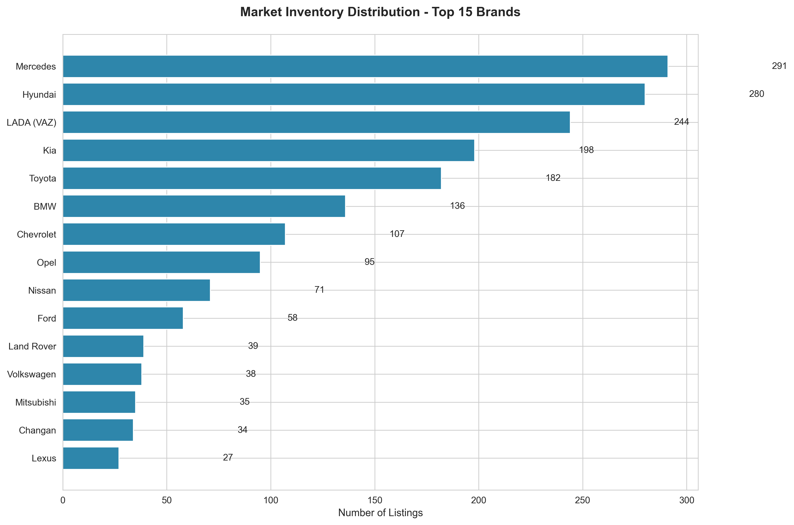

**What This Shows:**
The marketplace inventory is dominated by a handful of popular brands, with the top 15 brands accounting for the majority of listings. This reveals clear consumer preferences and market demand patterns.

**Business Implications:**
- **Opportunity:** The concentration in specific brands indicates established customer trust and demand - these should be priority segments for marketing and inventory acquisition
- **Risk:** Over-reliance on specific brands creates vulnerability to manufacturer issues or supply chain disruptions
- **Action:** Diversification strategy needed for long-tail brands to capture niche markets and reduce competitive pressure in saturated segments

### 2. Seller Ecosystem Composition

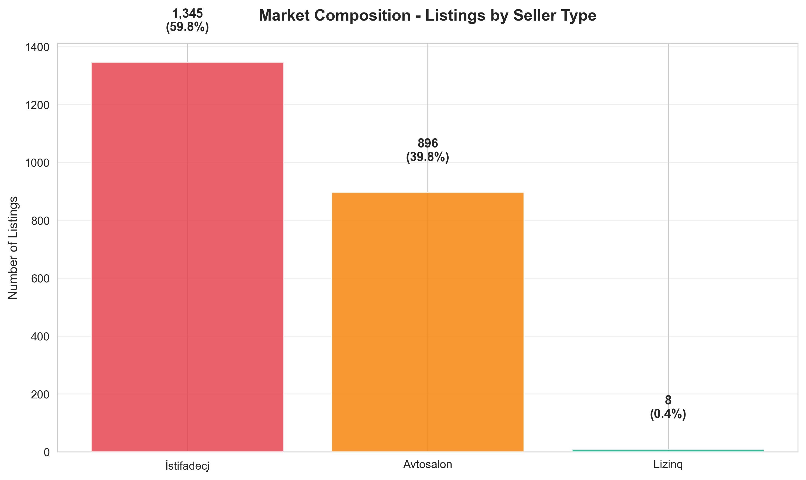

**What This Shows:**
The marketplace operates with a balanced mix of **60% individual sellers** and **40% professional dealers** (Avtosalon), with a small presence of leasing companies.

**Business Implications:**
- **Market Health:** The healthy balance indicates a mature marketplace serving both retail consumers and professional dealers
- **Platform Strategy:** Individual sellers represent organic supply growth, while dealers provide volume and consistency
- **Revenue Opportunity:** Different seller segments require different monetization strategies - dealers may pay for premium placement, while individuals need value-added services
- **Risk Management:** Individual sellers may have higher churn and lower inventory quality; dealers provide stability but have more negotiating power

---

## Pricing Intelligence & Revenue Optimization

### 3. Price Segmentation Analysis

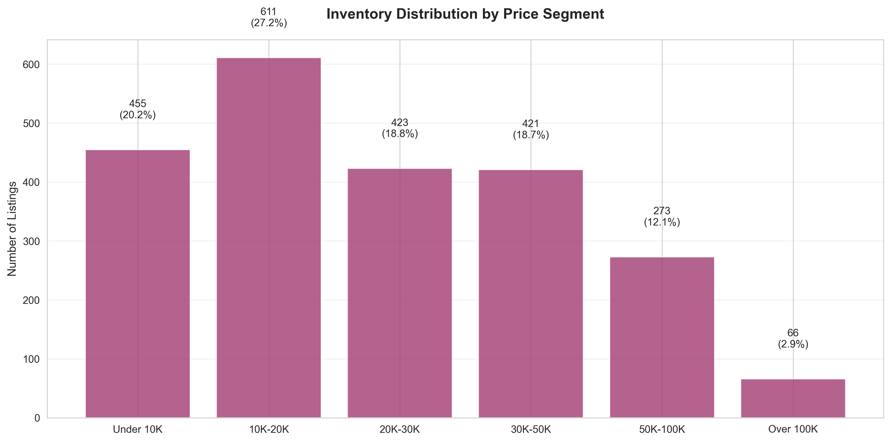

**What This Shows:**
The market shows clear price tier concentrations, with the majority of listings falling in the 10K-30K range, representing the mainstream market segment.

**Business Implications:**
- **Target Market:** The 10K-30K segment is the core market - this is where most buyers are shopping
- **Premium Opportunity:** Higher price segments (50K+) represent smaller volume but potentially higher margins and value-add services
- **Competitive Strategy:** Position differently for each segment - volume play in mainstream, premium services for luxury
- **Financing Need:** The concentration in mid-range prices suggests strong opportunity for credit financing partnerships

### 4. Brand-Level Pricing Strategy

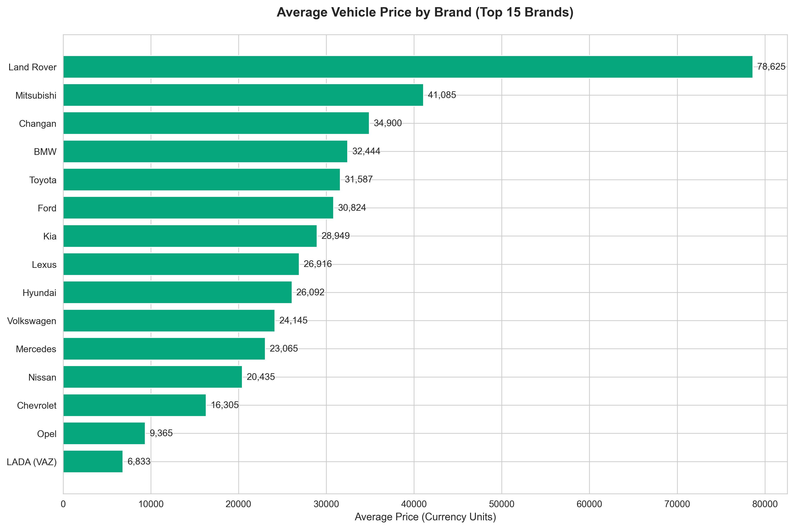

**What This Shows:**
Significant price variations exist across brands, with premium brands commanding 3-4x higher average prices than economy brands.

**Business Implications:**
- **Commission Structure:** Consider tiered pricing based on vehicle value - premium listings can support higher fees
- **Service Differentiation:** High-value listings need premium services (verification, photography, extended warranty options)
- **Buyer Targeting:** Different marketing strategies needed for economy vs. premium segments
- **Inventory Mix:** Balance between volume (economy brands) and margin (premium brands)

### 5. Depreciation Patterns and Value Retention

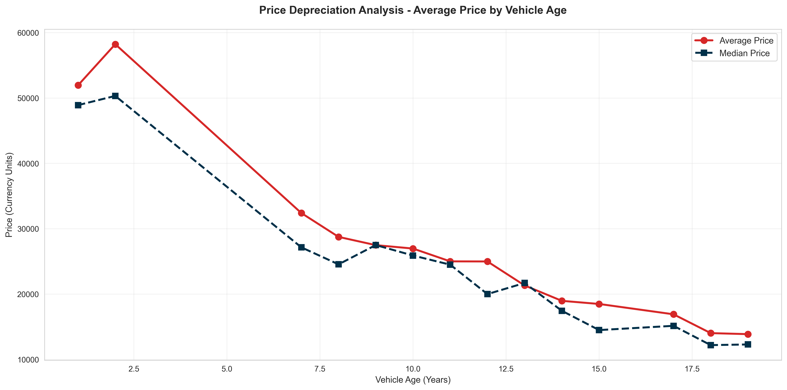

**What This Shows:**
Vehicle prices follow a predictable depreciation curve, with steeper declines in the first 5 years and stabilization after 10+ years.

**Business Implications:**
- **Inventory Strategy:** Newer vehicles (0-5 years) have higher turnover potential but steeper price sensitivity
- **Sweet Spot:** 5-10 year old vehicles offer best balance of price stability and market demand
- **Pricing Tools:** Automated pricing recommendations can help sellers price competitively based on age
- **Trade-In Programs:** Understanding depreciation is critical for developing trade-in valuation tools

### 6. Condition Impact on Pricing

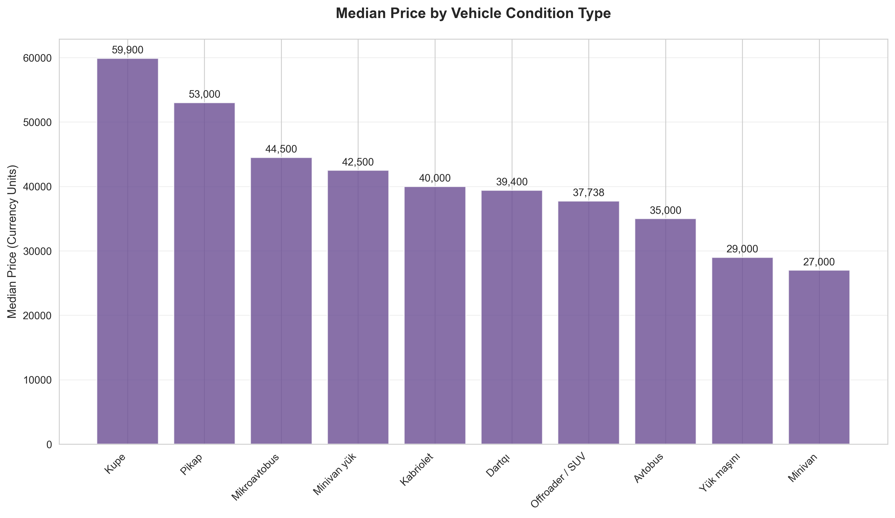

**What This Shows:**
Vehicle condition type significantly affects pricing, with certain condition categories commanding premium prices.

**Business Implications:**
- **Quality Verification:** Condition certification services can unlock premium pricing for sellers
- **Buyer Confidence:** Clear condition reporting reduces friction and increases conversion rates
- **Fraud Prevention:** Standardized condition categories help prevent misrepresentation
- **Service Opportunity:** Inspection and certification services represent additional revenue streams

---

## Customer Demand & Market Dynamics

### 7. Demand Indicators by Brand

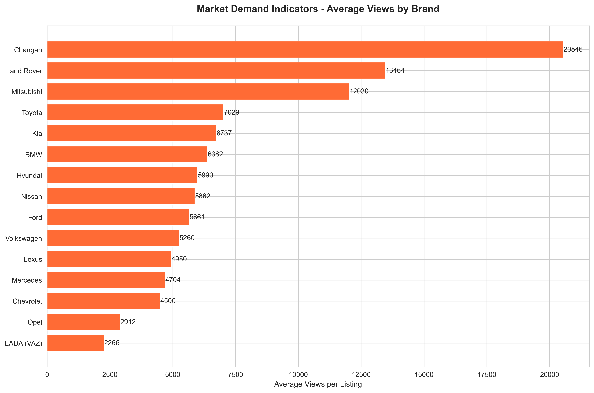

**What This Shows:**
Average views per listing vary significantly by brand, revealing which brands generate the most customer interest.

**Business Implications:**
- **High-Demand Brands:** Brands with high average views represent strong buyer interest - prioritize these in marketing
- **Supply-Demand Imbalance:** Low inventory but high views indicate unmet demand - opportunity for targeted seller recruitment
- **Advertising Strategy:** High-engagement brands are ideal for premium ad placements and featured listings
- **Inventory Planning:** Understanding demand patterns helps optimize inventory acquisition strategy

### 8. Engagement by Price Segment

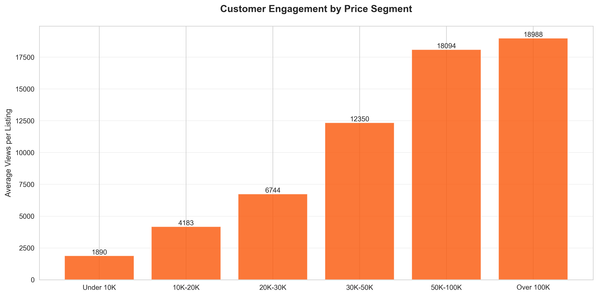

**What This Shows:**
Customer engagement (views per listing) varies across price segments, indicating where buyer interest is concentrated.

**Business Implications:**
- **Conversion Optimization:** Segments with high engagement but lower conversion need improved sales tools
- **Marketing Budget:** Allocate advertising spend proportional to engagement levels
- **Seller Education:** Help sellers understand which price segments move fastest to optimize pricing
- **Feature Development:** High-engagement segments should get priority for new features (360° photos, virtual tours, etc.)

### 9. Market Supply Trends

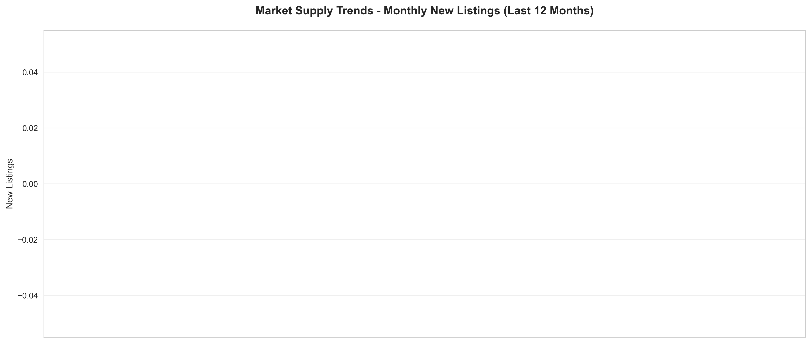

**What This Shows:**
Monthly listing volumes reveal market supply trends and seasonal patterns over the last 12 months.

**Business Implications:**
- **Seasonal Planning:** Clear seasonal patterns inform staffing, marketing budgets, and promotional timing
- **Growth Trajectory:** Upward trends indicate market expansion; downward trends signal need for seller incentives
- **Competitive Response:** Sudden changes may indicate competitor actions requiring strategic response
- **Inventory Management:** Predict capacity needs based on historical supply patterns

---

## Inventory Characteristics & Market Preferences

### 10. Fuel Type Distribution

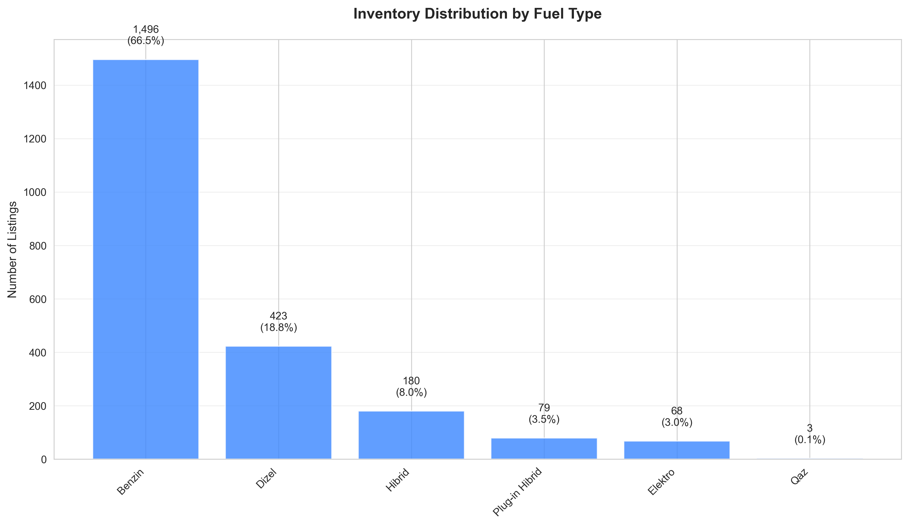

**What This Shows:**
The marketplace shows clear preferences for certain fuel types, with traditional gasoline dominating but growing interest in alternatives.

**Business Implications:**
- **Market Evolution:** Track shifts toward electric/hybrid to stay ahead of market transformation
- **Search & Filter:** Optimize search functionality based on most-searched fuel types
- **Environmental Positioning:** Growing alternative fuel segment represents opportunity for sustainability messaging
- **Partnership Opportunities:** Collaborate with charging network providers or fuel economy services

### 11. Transmission Preferences

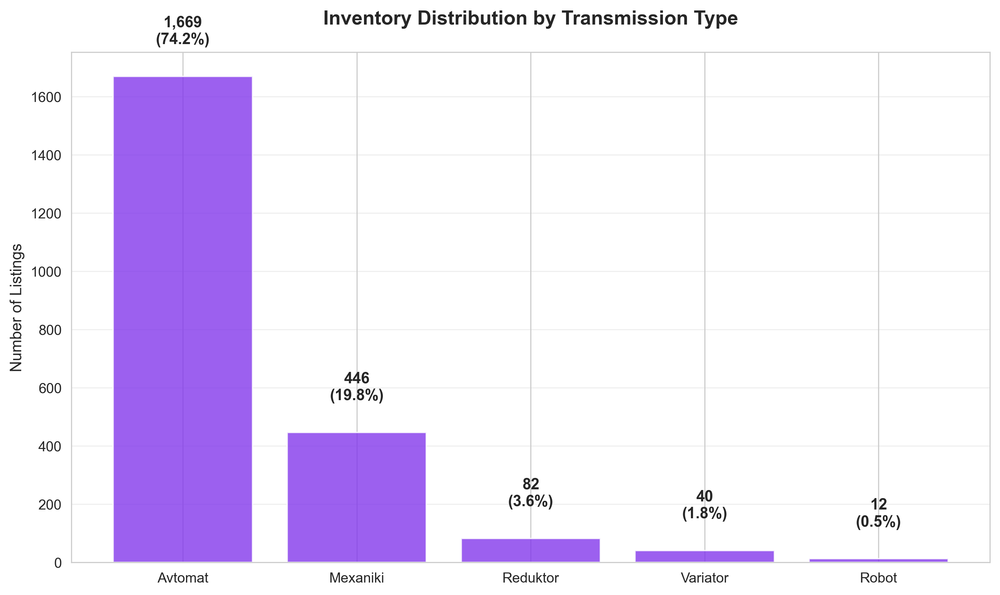

**What This Shows:**
The market demonstrates strong preferences for specific transmission types, revealing buyer sophistication and market maturity.

**Business Implications:**
- **Buyer Education:** Less popular transmission types may need educational content to drive sales
- **Inventory Signals:** Sellers should be guided toward market-preferred specifications
- **Price Sensitivity:** Automatic transmissions may command premium pricing in markets where manual is standard
- **Market Segmentation:** Different demographics prefer different transmissions - tailor marketing accordingly

### 12. Vehicle Age Distribution

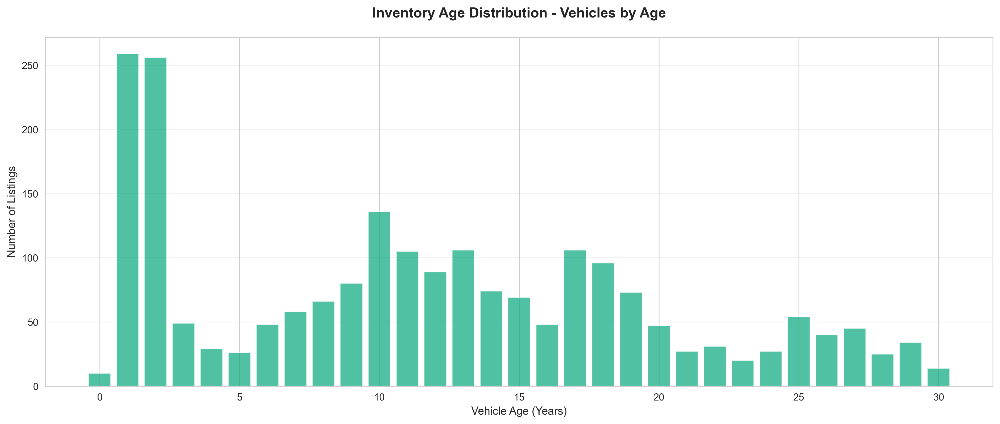

**What This Shows:**
The inventory age distribution reveals market positioning - whether focused on new, used, or vintage vehicles.

**Business Implications:**
- **Market Positioning:** High concentration in certain age ranges defines the marketplace's core value proposition
- **Warranty Services:** Older inventory may benefit from third-party warranty offerings
- **Financing Partners:** Age distribution informs which financing partners to work with (newer cars = traditional banks, older = alternative lenders)
- **Quality Control:** Older vehicles need more rigorous inspection and verification processes

### 13. Manufacturing Year Trends

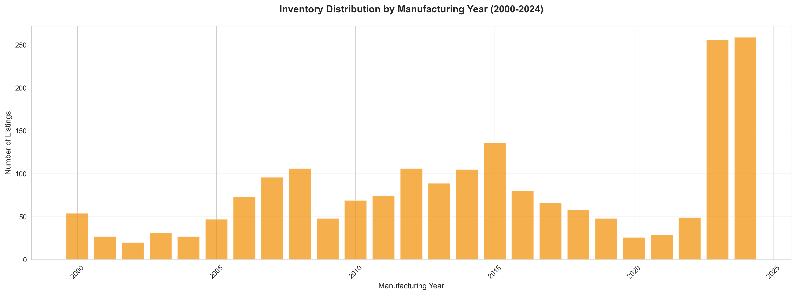

**What This Shows:**
Distribution of vehicles by manufacturing year shows market preferences and inventory freshness.

**Business Implications:**
- **Inventory Freshness:** Recent model years indicate active market; older years suggest potential stale inventory
- **Model Year Strategy:** Understand which years are most liquid for quick inventory turnover
- **Buyer Demographics:** Different age groups prefer different model year ranges
- **Depreciation Planning:** Certain model years may face accelerated depreciation (e.g., pre-facelift models)

---

## Geographic Strategy & Market Coverage

### 14. Geographic Concentration

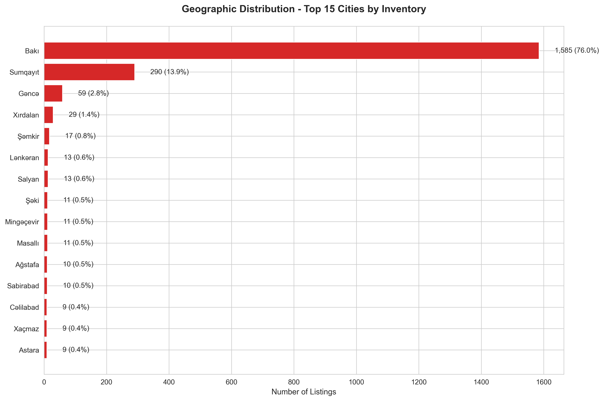

**What This Shows:**
**Baku dominates with 70.5% of all listings**, while 14 other cities account for the remaining 30%. Total coverage spans 55 cities.

**Business Implications:**
- **Urban Focus:** Baku is the core market - any platform improvements or marketing initiatives should prioritize this city
- **Expansion Opportunity:** The 55-city footprint shows broad reach, but 45 cities have minimal presence - opportunity for targeted growth
- **Logistics Planning:** Geographic concentration affects delivery, inspection, and customer service operations
- **Regional Strategies:** Secondary cities may need different value propositions or pricing to drive growth
- **Market Penetration:** Low penetration in smaller cities could indicate untapped opportunity or structural barriers

---

## Payment Flexibility & Financial Services

### 15. Payment Options Analysis

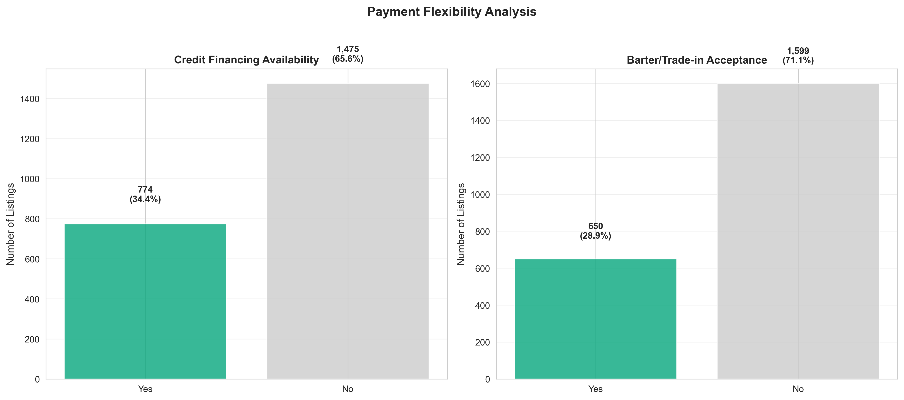

**What This Shows:**
**34% of listings offer credit financing** and **29% accept barter/trade-ins**, indicating significant but not universal payment flexibility.

**Business Implications:**
- **Conversion Barrier:** 66% of listings NOT offering credit represents lost sales to buyers who need financing
- **Partnership Opportunity:** Integrate financing partners to enable credit for all sellers, not just those with existing relationships
- **Competitive Advantage:** Listings with flexible payment options likely convert faster - this could be a premium service
- **Trade-In Platform:** Barter acceptance shows demand for trade-in functionality - could be developed into a feature
- **Seller Education:** Many sellers may not realize they can offer these options - opportunity to enable and educate

**Revenue Opportunity:**
- Financing facilitation fees
- Trade-in valuation services
- Insurance and warranty product sales at point of purchase

---

## Top Sellers and Market Concentration

### 16. Seller Concentration Analysis

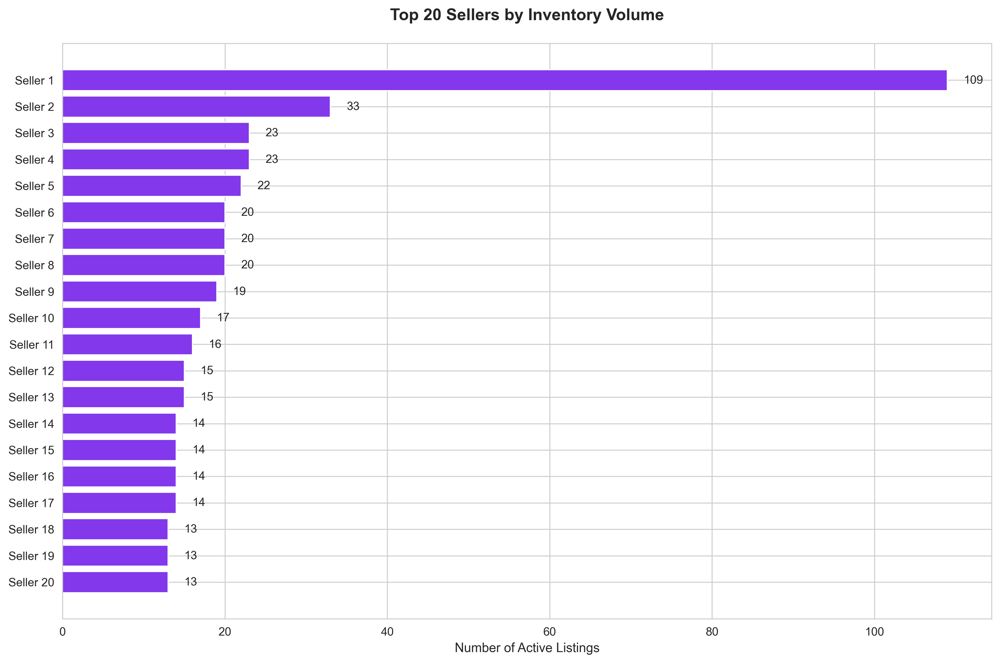

**What This Shows:**
A small number of high-volume sellers (likely professional dealers) control significant inventory, with the top 20 sellers accounting for a substantial portion of listings.

**Business Implications:**
- **Wholesale vs. Retail:** The presence of high-volume sellers indicates a two-tier market (professional dealers vs. individual sellers)
- **Platform Dependency:** Top sellers represent revenue concentration risk - losing a major dealer could significantly impact metrics
- **Negotiating Power:** High-volume sellers will demand volume discounts, premium placement, and special features
- **Quality Control:** Large sellers may have better processes but also potential for bulk fraud - need robust verification
- **Relationship Management:** Top sellers need dedicated account management and premium support

**Strategic Considerations:**
- Develop enterprise/dealer tier with dedicated features
- Balance platform between serving individuals and professionals
- Create loyalty programs to retain high-volume sellers
- Monitor competitive threats targeting your top inventory sources

---

## Strategic Recommendations

### Immediate Priorities (0-3 Months)

1. **Financing Integration**
   Partner with financial institutions to offer credit options on all listings. This addresses the 66% of inventory without financing and can significantly boost conversion rates.

2. **Baku Market Optimization**
   With 70% of inventory in Baku, invest in local market dominance - enhanced delivery services, physical verification centers, and localized marketing.

3. **Dealer Relationship Program**
   Launch dedicated account management for top 20 sellers to reduce churn risk and increase loyalty.

### Medium-Term Initiatives (3-6 Months)

4. **Trade-In Platform Development**
   Build integrated trade-in functionality to capture the 29% of sellers willing to accept barter and streamline the vehicle exchange process.

5. **Regional Expansion Strategy**
   Target specific secondary cities with concentrated marketing campaigns to reduce geographic dependency on Baku.

6. **Premium Brand Strategy**
   Develop specialized services for high-value listings (50K+ segment) including professional photography, certification, and extended warranties.

### Long-Term Strategic Goals (6-12 Months)

7. **Dynamic Pricing Tools**
   Implement AI-powered pricing recommendations based on age, condition, brand, and market demand to help sellers optimize pricing.

8. **Quality Verification Program**
   Launch standardized vehicle inspection and certification service to build buyer confidence and enable premium pricing.

9. **Alternative Fuel Positioning**
   Prepare for market shift toward electric/hybrid vehicles with specialized content, search features, and charging network partnerships.

---

## Risk Factors & Mitigation

### Market Risks
- **Geographic Concentration:** 70% inventory in Baku creates vulnerability to local economic shocks
  *Mitigation:* Accelerate regional expansion

- **Seller Concentration:** Top sellers control significant volume
  *Mitigation:* Diversify supply with individual seller growth programs

- **Brand Dependence:** Top brands dominate inventory
  *Mitigation:* Expand into underserved niches and emerging brands

### Operational Risks
- **Financing Gap:** 66% of listings lack credit options
  *Mitigation:* Urgent integration with financing partners

- **Quality Concerns:** High volume of older vehicles (avg 12.7 years)
  *Mitigation:* Implement verification and warranty programs

- **Payment Flexibility:** Only 29% accept trade-ins
  *Mitigation:* Build integrated trade-in platform

---

## Conclusion

The marketplace demonstrates strong fundamentals with healthy engagement (17.7M views), diverse geographic reach (55 cities), and balanced seller composition. However, significant opportunities exist in **financing enablement**, **geographic expansion beyond Baku**, and **premium service development**.

The data reveals a mature market with clear segmentation by price, brand, and customer preferences. Strategic focus on the identified growth areas - particularly financing integration and regional expansion - can drive substantial revenue growth while reducing concentration risks.

**Next Steps:**
1. Review findings with stakeholder teams
2. Prioritize recommendations based on resource availability
3. Develop detailed implementation roadmaps for top 3 priorities
4. Establish KPIs to measure impact of strategic initiatives

---

*Analysis based on 2,249 active listings | All charts available in `/charts` directory | For questions or deeper analysis, contact the analytics team*
